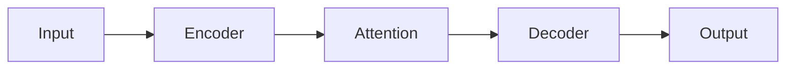

# Paper Summarization Guide

This guide covers how to generate high-quality paper summaries.

## Output Location

Save summary to:
```
~/knowledge/summary_{tag}.md
```

**Important**: Use local project directory (`~/Documents/obsidian/80-paper/
`), not `~/.cache/`, and not , pls notice that the `~` is the home directory.

## Tag Selection

> [!important] Tag Management Required
> Before adding tags, you **must** check claude-mem for existing tags.
> See [obsidian-output.md](obsidian-output.md) for the complete tag management workflow.


Choose a descriptive tag that:
- Relates to the paper's main topic
- Is unique (avoid overwriting existing files)
- Uses snake_case (e.g., `conditional_memory`, `transformer_attention`)

### Tag Examples

| Paper Topic | Suggested Tag |
|-------------|---------------|
| Language model scaling | `llm_scaling_laws` |
| Attention mechanism | `efficient_attention` |
| Memory mechanism | `context_compression` |

## Summary Structure

### Recommended Format (Obsidian Native)

```markdown
---
title: {Paper Title}
date: {YYYY-MM-DD}
tags:
  - {tag1}
  - {tag2}
aliases:
  - {Paper Title}
  - arXiv:{id}
---

# {Paper Title}

> [!info]- Metadata
> - **arXiv**: [{id}](https://arxiv.org/abs/{id})
> - **Authors**: {authors}
> - **Date**: {publication_date}

## Abstract

> [!abstract]+
> {Brief summary of the paper's main contribution}

## Solved problems

> !problems+
> {Brief summary of the problems which the paper solved}


## Key Findings

> [!key-findings]-
> - Finding 1
> - Finding 2
> - Finding 3

## Technical Details

### Method

> [!method]+
> {Description of the proposed method}

### Results

> [!results]
> {Key experimental results}

### Architecture Diagrams

If the paper describes system architectures, pipelines, or component relationships that benefit from visual representation:

> [!tip] Use mermaid-diagrams skill
> When the paper contains architecture diagrams, pipelines, or complex component relationships, invoke the **mermaid-diagrams** skill to generate proper Mermaid syntax.
>
> **When to use:**
> - System architecture diagrams
> - Data flow pipelines
> - Model training workflows
> - Component interaction diagrams
> - State machines or process flows
>
> **How to invoke:**
> ```
> Skill: mermaid-diagrams
> ```
> Then describe the architecture you need to diagram based on the paper's content.

**Example - Adding a Mermaid diagram in Obsidian:**

```markdown
## System Architecture


```

## Relevance to Project

> [!tip]
> {Connection to current project context}

## Potential Applications

> [!example]
> - Application 1
> - Application 2

## Questions/Follow-ups

> [!question]
> - Question 1
> - Question 2
```


## Quality Guidelines

### Do ✅

1. **Be concise**: Focus on key insights
2. **Connect to context**: Relate to current project
3. **Include technical details**: Methodology matters
4. **Highlight novel contributions**: What's new?

### Don't ❌

1. **Don't copy abstract**: Summarize in your own words
2. **Don't skip methodology**: Technical depth is important
3. **Don't ignore limitations**: Note constraints
4. **Don't over-quote**: Paraphrase key points

## Length Guidelines

| Section | Target Length |
|---------|---------------|
| Abstract | 2-3 sentences |
| Key Findings | 3-5 bullet points |
| Technical Details | 1-2 paragraphs |
| Relevance | 1 paragraph |

## Connection to Project

When relating to the current project:

1. **Identify overlaps**: What problems does this solve?
2. **Note potential applications**: How can we use this?
3. **Consider implementation**: What's needed to apply?
4. **Highlight risks**: Any concerns or limitations?

## Review Checklist

Before finalizing:

- [ ] Title and metadata correct?
- [ ] Key findings captured?
- [ ] Methodology explained?
- [ ] Project connection clear?
- [ ] Tags checked against claude-mem?
- [ ] New tags saved to claude-mem?
- [ ] File saved to correct location?

## Obsidian Output

The output format is now Obsidian-native by default (frontmatter + callouts). See [obsidian-output.md](obsidian-output.md) for advanced tag management.
